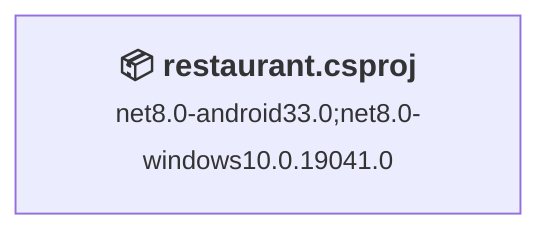
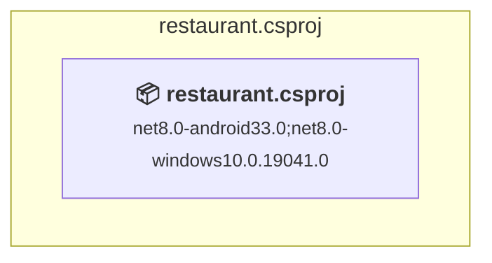

# Projects and dependencies analysis

This document provides a comprehensive overview of the projects and their dependencies in the context of upgrading to .NETCoreApp,Version=v10.0.

## Table of Contents

- [Executive Summary](#executive-Summary)
  - [Highlevel Metrics](#highlevel-metrics)
  - [Projects Compatibility](#projects-compatibility)
  - [Package Compatibility](#package-compatibility)
  - [API Compatibility](#api-compatibility)
- [Aggregate NuGet packages details](#aggregate-nuget-packages-details)
- [Top API Migration Challenges](#top-api-migration-challenges)
  - [Technologies and Features](#technologies-and-features)
  - [Most Frequent API Issues](#most-frequent-api-issues)
- [Projects Relationship Graph](#projects-relationship-graph)
- [Project Details](#project-details)

  - [restaurant\restaurant.csproj](#restaurantrestaurantcsproj)

## Executive Summary

### Highlevel Metrics

| Metric | Count | Status |
| :--- | :---: | :--- |
| Total Projects | 1 | All require upgrade |
| Total NuGet Packages | 21 | 2 need upgrade |
| Total Code Files | 95 |  |
| Total Code Files with Incidents | 6 |  |
| Total Lines of Code | 15066 |  |
| Total Number of Issues | 13 |  |
| Estimated LOC to modify | 10+ | at least 0,1% of codebase |

### Projects Compatibility

| Project | Target Framework | Difficulty | Package Issues | API Issues | Est. LOC Impact | Description |
| :--- | :---: | :---: | :---: | :---: | :---: | :--- |
| [restaurant\restaurant.csproj](#restaurantrestaurantcsproj) | net8.0-android33.0;net8.0-windows10.0.19041.0 | 🟢 Low | 2 | 10 | 10+ | DotNetCoreApp, Sdk Style = True |

### Package Compatibility

| Status | Count | Percentage |
| :--- | :---: | :---: |
| ✅ Compatible | 19 | 90,5% |
| ⚠️ Incompatible | 1 | 4,8% |
| 🔄 Upgrade Recommended | 1 | 4,8% |
| ***Total NuGet Packages*** | ***21*** | ***100%*** |

### API Compatibility

| Category | Count | Impact |
| :--- | :---: | :--- |
| 🔴 Binary Incompatible | 0 | High - Require code changes |
| 🟡 Source Incompatible | 4 | Medium - Needs re-compilation and potential conflicting API error fixing |
| 🔵 Behavioral change | 6 | Low - Behavioral changes that may require testing at runtime |
| ✅ Compatible | 18631 |  |
| ***Total APIs Analyzed*** | ***18641*** |  |

## Aggregate NuGet packages details

| Package | Current Version | Suggested Version | Projects | Description |
| :--- | :---: | :---: | :--- | :--- |
| ClosedXML | 0.105.0 |  | [restaurant.csproj](#restaurantrestaurantcsproj) | ✅Compatible |
| CommunityToolkit.Maui | 7.0.1 |  | [restaurant.csproj](#restaurantrestaurantcsproj) | ✅Compatible |
| CommunityToolkit.Mvvm | 8.2.0 |  | [restaurant.csproj](#restaurantrestaurantcsproj) | ✅Compatible |
| FirebaseAdmin | 3.4.0 |  | [restaurant.csproj](#restaurantrestaurantcsproj) | ✅Compatible |
| FirebaseAuthentication.net | 4.1.0 |  | [restaurant.csproj](#restaurantrestaurantcsproj) | ✅Compatible |
| FirebaseDatabase.net | 5.0.0 |  | [restaurant.csproj](#restaurantrestaurantcsproj) | ✅Compatible |
| Google.Cloud.Firestore | 3.11.0 |  | [restaurant.csproj](#restaurantrestaurantcsproj) | ✅Compatible |
| LiveCharts.Core | 0.9.8 |  | [restaurant.csproj](#restaurantrestaurantcsproj) | ✅Compatible |
| Microcharts.Maui | 1.0.1 |  | [restaurant.csproj](#restaurantrestaurantcsproj) | ⚠️NuGet package is incompatible |
| Microsoft.Extensions.Logging.Debug | 8.0.0 | 10.0.3 | [restaurant.csproj](#restaurantrestaurantcsproj) | NuGet package upgrade is recommended |
| Microsoft.Maui.Controls | 8.0.100 |  | [restaurant.csproj](#restaurantrestaurantcsproj) | ✅Compatible |
| Microsoft.Maui.Controls.Compatibility | 8.0.100 |  | [restaurant.csproj](#restaurantrestaurantcsproj) | ✅Compatible |
| Newtonsoft.Json | 13.0.4 |  | [restaurant.csproj](#restaurantrestaurantcsproj) | ✅Compatible |
| Plugin.Firebase.CloudMessaging | 3.1.2 |  | [restaurant.csproj](#restaurantrestaurantcsproj) | ✅Compatible |
| Plugin.Firebase.Core | 3.1.1 |  | [restaurant.csproj](#restaurantrestaurantcsproj) | ✅Compatible |
| Plugin.FirebasePushNotification | 3.4.35 |  | [restaurant.csproj](#restaurantrestaurantcsproj) | ✅Compatible |
| SendGrid | 9.29.3 |  | [restaurant.csproj](#restaurantrestaurantcsproj) | ✅Compatible |
| SkiaSharp | 2.88.9 |  | [restaurant.csproj](#restaurantrestaurantcsproj) | ✅Compatible |
| SkiaSharp.Views.Maui.Controls | 2.88.9 |  | [restaurant.csproj](#restaurantrestaurantcsproj) | ✅Compatible |
| System.Private.Uri | 4.3.2 |  | [restaurant.csproj](#restaurantrestaurantcsproj) | ✅Compatible |
| Twilio | 7.13.4 |  | [restaurant.csproj](#restaurantrestaurantcsproj) | ✅Compatible |

## Top API Migration Challenges

### Technologies and Features

| Technology | Issues | Percentage | Migration Path |
| :--- | :---: | :---: | :--- |

### Most Frequent API Issues

| API | Count | Percentage | Category |
| :--- | :---: | :---: | :--- |
| T:System.Net.Http.HttpContent | 6 | 60,0% | Behavioral Change |
| M:System.TimeSpan.FromSeconds(System.Double) | 4 | 40,0% | Source Incompatible |

## Projects Relationship Graph

Legend:
📦 SDK-style project
⚙️ Classic project

## Project Details

### restaurant\restaurant.csproj

#### Project Info

- **Current Target Framework:** net8.0-android33.0;net8.0-windows10.0.19041.0
- **Proposed Target Framework:** net8.0-android33.0;net8.0-windows10.0.19041.0;net10.0-windows
- **SDK-style**: True
- **Project Kind:** DotNetCoreApp
- **Dependencies**: 0
- **Dependants**: 0
- **Number of Files**: 95
- **Number of Files with Incidents**: 6
- **Lines of Code**: 15066
- **Estimated LOC to modify**: 10+ (at least 0,1% of the project)

#### Dependency Graph

Legend:
📦 SDK-style project
⚙️ Classic project

### API Compatibility

| Category | Count | Impact |
| :--- | :---: | :--- |
| 🔴 Binary Incompatible | 0 | High - Require code changes |
| 🟡 Source Incompatible | 4 | Medium - Needs re-compilation and potential conflicting API error fixing |
| 🔵 Behavioral change | 6 | Low - Behavioral changes that may require testing at runtime |
| ✅ Compatible | 18631 |  |
| ***Total APIs Analyzed*** | ***18641*** |  |

