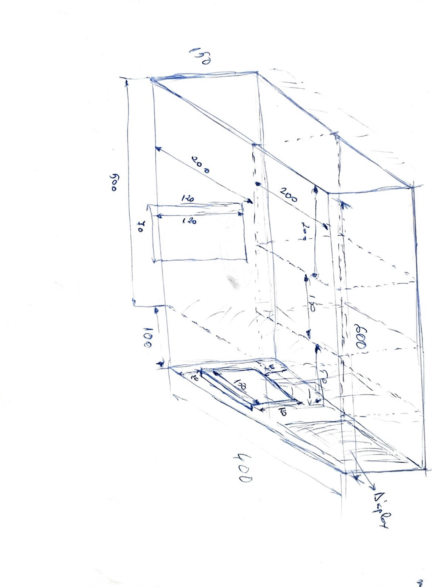
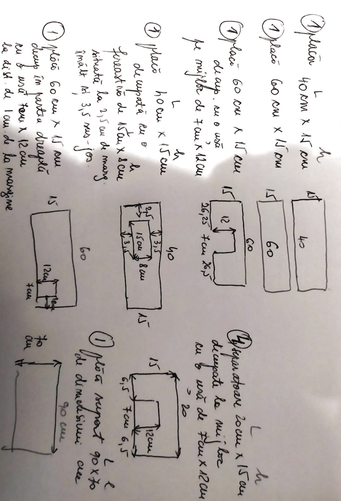

# Documentație tehnică - Sistem Inteligent de Management al Restaurantului (SIMR)

## Descrierea problemei

În industria HoReCa, procesele de gestionare a comenzilor, ingredientelor, personalului și interacțiunii cu clienții sunt în continuare efectuate în mare parte manual, ceea ce duce la:

- Întârzieri în procesarea comenzilor și livrării acestora.
- Erori umane în calcularea stocurilor și rețetelor.
- Lipsa transparenței în monitorizarea consumului și profitabilității.
- Costuri suplimentare datorate risipelor alimentare și aprovizionării haotice.
- Experiență deficitară pentru client din cauza timpilor mari de așteptare și lipsei digitalizării.

Aceste probleme afectează profitabilitatea, satisfacția clientului și calitatea serviciilor.

## Soluția propusă

SIMR este o platformă hibridă software-hardware care optimizează automatizat fluxurile dintr-un restaurant:

- Digitalizează complet procesele de gestiune a stocurilor, comenzilor și personalului.
- Utilizează IoT și senzori pentru monitorizarea în timp real a condițiilor de depozitare.
- Integrează AI pentru recomandări de marketing și analize predictive.
- Include modul drive-thru automatizat cu interfață pentru client.
- Comunicarea și stocarea datelor se realizează în cloud (Firebase), garantând scalabilitatea și actualizarea în timp real.

## Public țintă

- Restaurante mici și medii ce doresc digitalizare rapidă și cu cost redus.
- Lanțuri de restaurante care au nevoie de control centralizat asupra tuturor locațiilor.
- Manageri și bucătari care doresc să optimizeze costurile și timpii de lucru.
- Clienți orientați către experiențe digitale și rapide (comandă la masă sau drive-thru).

## Analiza pieței și diferențiatori

Există soluții pe piață (Glovo, Tazz, Square POS), însă acestea acoperă doar parțial nevoile unui restaurant.  
SIMR este unic prin:

- Gestiune complet automatizată a ingredientelor și meniurilor.
- Drive-thru fizic integrat cu hardware și software.
- Predicție AI pentru aprovizionare inteligentă.
- Comenzi automate către furnizori în funcție de stocuri.
- Integrare IoT pentru siguranța alimentelor (temperatură, umiditate, greutate).

## Funcționalități detaliate

### Aplicația Admin (MAUI – Windows & Android)

- Gestiune ingrediente: adăugare, modificare, ștergere, cu urmărirea cantităților și unităților de măsură.
- Alertare stocuri critice: notificări când ingredientele scad sub un prag definit.
- Vizualizare meniuri și rețete: afișare compoziție produse, cantități necesare.
- Statistici, rapoarte vizuale și analize AI:
  - Previziune consum ingrediente → Reduce risipa alimentară.
  - Analiză popularitate produse → Optimizează meniul.
  - Sugestii aprovizionare → Comenzi automate către furnizori.
  - Raport profitabilitate per produs → Ajută la decizii de business.
- Control personal: creare conturi angajați, pontaj, roluri (chelner, bucătar, manager).
- Predicție și recomandări AI: aprovizionare optimă pentru reducerea pierderilor.

### Aplicația Client (Kotlin – Android)

- Acces meniu în timp real sincronizat cu stocurile.
- Plasare comandă rapidă cu opțiuni de personalizare.
- Alegere între servire la masă sau drive-thru.
- Notificări despre statusul comenzii (pregătire, livrare).
- Sistem de fidelitate al clienților cu carduri, respectiv coduri de reducere primite prin email / Happy Hour

### Sistem IoT – Monitorizare și Automatizare

#### Arduino Nano ESP32:

- Senzori presiune pentru măsurarea greutății ingredientelor.
- DHT11 pentru control temperatură/umiditate în depozit.
- Ventilatoare automate în funcție de valori critice.
- Comunicare real-time cu Firebase pentru actualizarea aplicațiilor.

#### Arduino UNO + Raspberry Pi 5:

- Senzor de mișcare pentru detectarea vehiculului la drive-thru.
- Semafor LED pentru semnalizarea traficului la fereastra de drive-thru.
- Afișaj LED cu mesaje dinamice pentru clienții care așteaptă.
- Touchscreen interactiv cu aplicația client pentru plasarea comenzilor.

## Securitate implementată

- Autentificare Firebase (email + parolă) cu roluri configurate.
- Reguli Firebase stricte pentru citire/scriere doar pe UID-ul proprietarului.
- Validare input în aplicații
- Criptare conexiuni între aplicații și Firebase.


## Tehnologii utilizate

| Componentă      | Tehnologie                                    |
|------------------|----------------------------------------------|
| Admin App        | .NET MAUI + CommunityToolkit.Mvvm          |
| Client App       | Kotlin + Jetpack Compose                   |
| Backend          | Firebase Realtime DB + Firebase Auth       |
| AI               | Gemini AI                                  |
| Email            | SendGrid / Java Mail                                 |
| Statistici       | Microcharts + LiveCharts           |
| Senzori          | Arduino Nano ESP32 + DHT11 + senzor presiune + modul Peltier + senzor gaz metan|
| Drive-thru       | Arduino UNO cu senzor de mișcare, semafor LED și Display LED + Raspberry Pi 5 + HDMI Display|

## Roadmap
1. **Faza 1:** Realizarea unui studiu de piață.
2. **Faza 2:** Dezvoltarea aplicației de management
3. **Faza 3:** Dezvoltarea aplicației pentru clienți
4. **Faza 4:** Implementarea sistemului hardware

## Opinia autorilor
Considerăm că SIMR aduce o contribuție semnificativă în domeniul gestionării eficiente a resurselor într-un restaurant. Prin integrarea tehnologiilor moderne, oferim o soluție care nu doar că reduce risipa alimentară, dar îmbunătățește și experiența clienților și eficiența operațională a personalului. 

## Resurse externe

- Firebase SDK
- Gemini AI SDK
- SendGrid API
- Java Mail
- Arduino libraries pentru DHT11 și Firebase ESP32
- MAUI CommunityToolkit

## Anexa 1 - Ghid de instalare și utilizare a aplicațiilor

- **SIMR Admin**: [https://bit.ly/simr2025-infoedu-ghid-admin](https://bit.ly/simr2025-infoedu-ghid-admin)
- **SIMR Tables**: [https://bit.ly/simr2025-infoedu-ghid-tables](https://bit.ly/simr2025-infoedu-ghid-tables)

## Anexa 2 - Arhitectura sistemului


## Anexa 3 - Schema machetei

  


## Anexa 4 - Firebase Realtime Database Security Rules

```json
{
  "rules": {
    ".read": "auth != null",
    ".write": "auth != null",
    "kitchen": {
      "$ownerId": {
        ".read": "auth != null && (auth.uid === $ownerId || root.child('users').child(auth.uid).child('Owner').val() === $ownerId)",
        ".write": "auth != null && (auth.uid === $ownerId || root.child('users').child(auth.uid).child('Owner').val() === $ownerId)"
      }
    },
    "users": {
      "$userId": {
        ".read": "auth != null && (auth.uid === $userId || root.child('users').child(auth.uid).child('Owner').val() === root.child('users').child($userId).child('Owner').val() || (root.child('users').child(auth.uid).child('Type').val() === 'owner' && root.child('users').child($userId).child('Owner').val() === auth.uid))",
        ".write": "auth != null && (auth.uid === $userId || (root.child('users').child(auth.uid).child('Type').val() === 'owner' && root.child('users').child($userId).child('Owner').val() === auth.uid))"
      }
    }
  }
}
```

## Anexa 5 - Schema Arduino Nano ESP32


## Anexa 6 - Schema Arduino UNO


## Anexa 7 - Schema Raspberry PI 5

