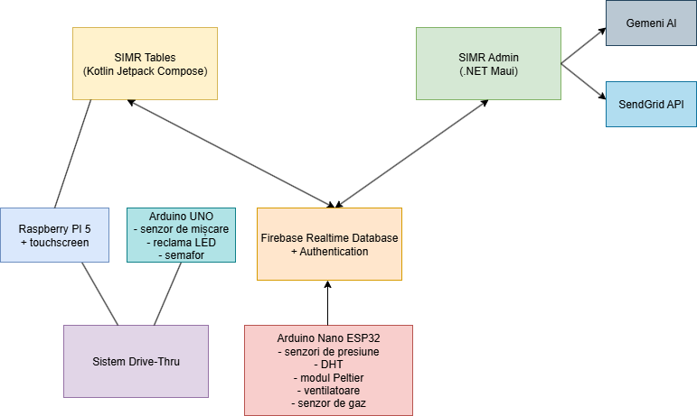
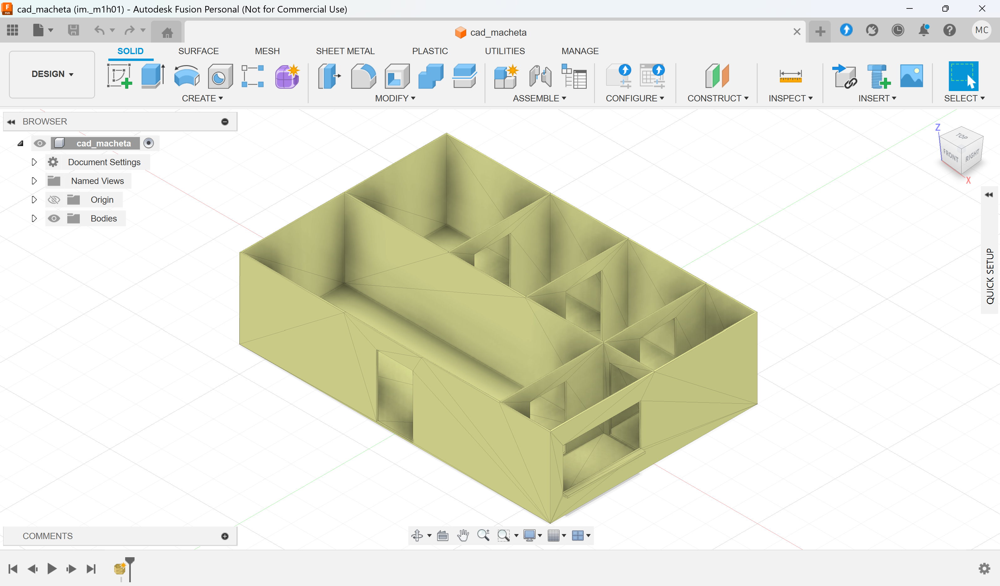
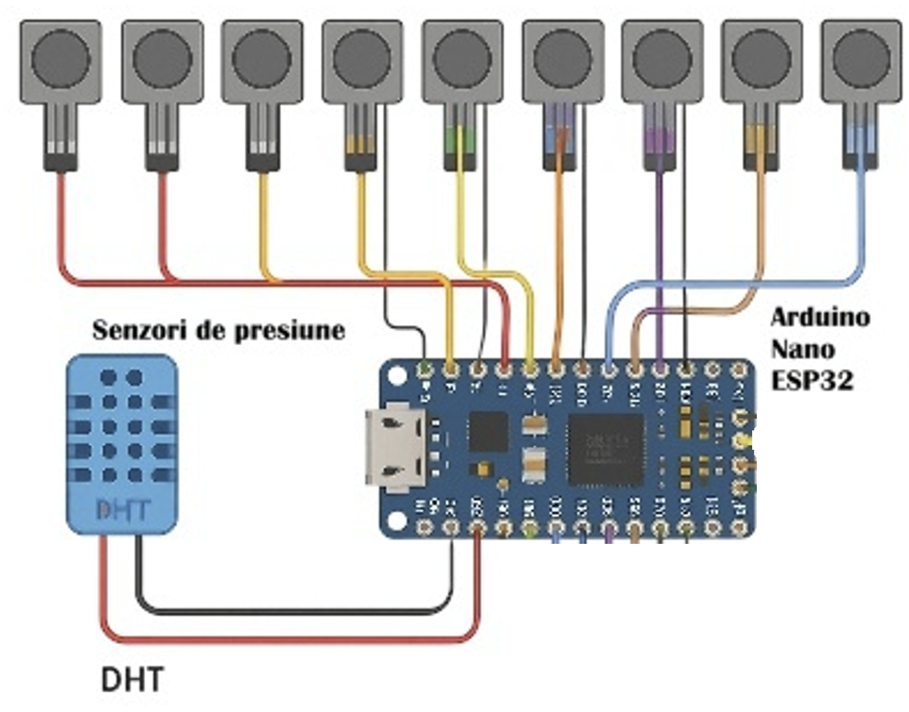
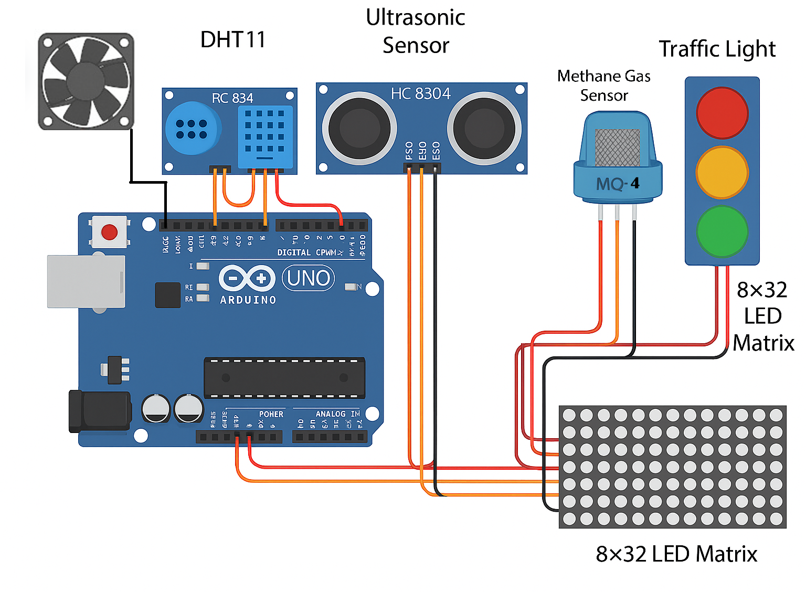
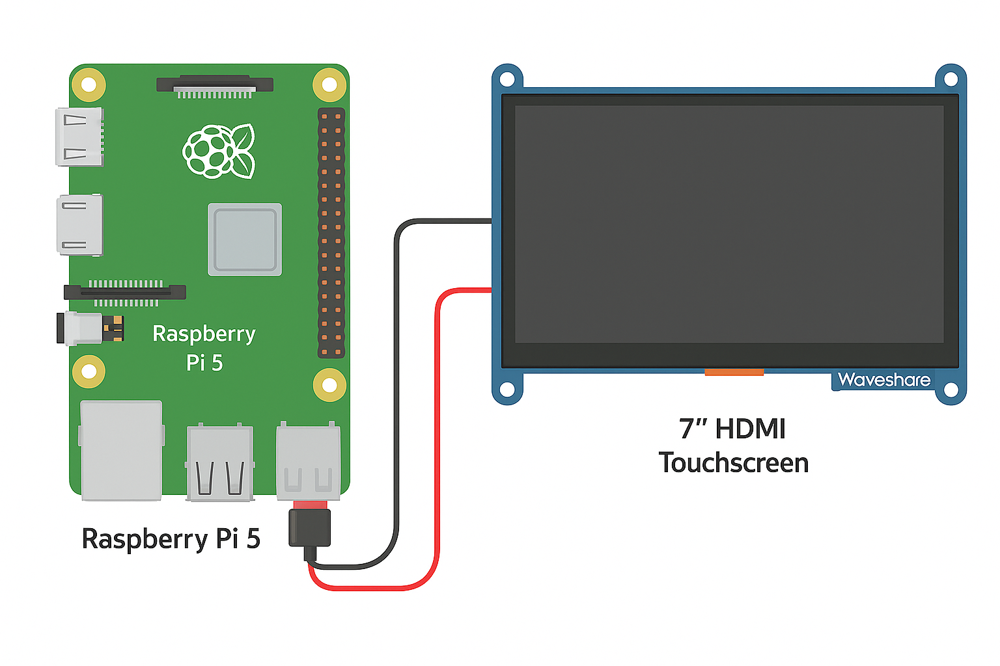

# Technical Documentation – Intelligent Restaurant Management System (SIMR)

## **Problem Description**

In the HoReCa industry, processes related to order management, ingredients, staff, and customer interaction are still mostly done manually, leading to:

* Delays in processing and delivering orders
* Human errors in stock calculation and recipes
* Lack of transparency in monitoring consumption and profitability
* Additional costs due to food waste and chaotic supply management
* Poor customer experience caused by long waiting times and lack of digitalization

These issues affect profitability, customer satisfaction, and overall service quality.

---

## **Proposed Solution**

**SIMR** is a hybrid software-hardware platform that automates and optimizes restaurant workflows:

* Fully digitalizes stock, order, and staff management
* Uses IoT and sensors for real-time monitoring of storage conditions
* Integrates AI for marketing recommendations and predictive analytics
* Includes an automated drive-thru system with a client interface
* Cloud-based communication and storage (Firebase) for scalability and real-time updates

---

## **Target Audience**

* Small and medium-sized restaurants needing fast, low-cost digitalization
* Restaurant chains requiring centralized control across locations
* Managers and chefs seeking to optimize costs and workflow
* Customers wanting fast, digitalized ordering (table or drive-thru)

---

## **Market Analysis & Differentiators**

Current solutions (Glovo, Tazz, Square POS) cover only limited aspects of restaurant operations.
**SIMR stands out through:**

* Fully automated ingredient and menu management
* Hardware–software–integrated physical drive-thru
* AI-based smart restocking predictions
* Automatic supplier ordering based on stock
* IoT for food safety (temperature, humidity, weight)

---

## **Detailed Functionalities**

### **Admin App (MAUI – Windows & Android)**

* Ingredient management: add, edit, delete, track quantities and units
* Critical stock alerts
* Menu and recipe viewer: ingredient composition and required amounts
* Statistics, visual reports, and AI analytics

  * Ingredient consumption forecasting
  * Product popularity analysis
  * Smart supply suggestions
  * Profitability per product
* Employee management: roles, accounts, time tracking
* AI-based restocking recommendations

---

### **Client App (Kotlin – Android)**

* Real-time menu synced with stock levels
* Fast order placement with customization options
* Table service or drive-thru choice
* Real-time order status notifications
* Customer loyalty system (cards, coupons, Happy Hour discounts)

---

## **IoT System – Monitoring & Automation**

### **Arduino Nano ESP32**

* Pressure sensors → ingredient weight
* DHT11 → temperature & humidity
* Automatic fans triggered by critical conditions
* Real-time Firebase communication

### **Arduino UNO + Raspberry Pi 5**

* Motion sensor → detect vehicles at drive-thru
* LED traffic light at the drive-thru window
* LED display with dynamic messages
* Touchscreen interface for placing client orders

---

## **Security Implemented**

* Firebase Auth (email + password) with role management
* Strict Firebase rules: read/write only on the owner’s UID
* Input validation in all applications
* Encrypted communication with Firebase

---

## **Technologies Used**

| Component  | Technology                                                                                    |
| ---------- | --------------------------------------------------------------------------------------------- |
| Admin App  | .NET MAUI + CommunityToolkit.Mvvm                                                             |
| Client App | Kotlin + Jetpack Compose                                                                      |
| Backend    | Firebase Realtime Database + Firebase Auth                                                    |
| AI         | Gemini AI                                                                                     |
| Email      | SendGrid / Java Mail                                                                          |
| Statistics | Microcharts + LiveCharts                                                                      |
| Sensors    | Arduino Nano ESP32 + DHT11 + pressure sensor + Peltier module + methane sensor                |
| Drive-thru | Arduino UNO + motion sensor + LED traffic light + LED Display + Raspberry Pi 5 + HDMI Display |

---

## **Roadmap**

1. **Phase 1:** Market research
2. **Phase 2:** Management app development
3. **Phase 3:** Client app development
4. **Phase 4:** Hardware system integration

---

## **Authors’ Opinion**

We believe SIMR significantly contributes to efficient resource management in restaurants. By integrating modern technologies, it reduces food waste, enhances customer experience, and increases operational efficiency.

---

## **External Resources**

* Firebase SDK
* Gemini AI SDK
* SendGrid API
* Java Mail
* Arduino libraries (DHT11, Firebase ESP32)
* MAUI CommunityToolkit

---

## **Annex 1 – Application Installation & User Guides**

* **SIMR Admin:** [https://bit.ly/simr2025-infoedu-ghid-admin](https://bit.ly/simr2025-infoedu-ghid-admin)
* **SIMR Tables:** [https://bit.ly/simr2025-infoedu-ghid-tables](https://bit.ly/simr2025-infoedu-ghid-tables)

---

## **Annex 2 – System Architecture**



---

## **Annex 3 – Physical Mockup Diagram**



---

## **Annex 4 – Firebase Realtime Database Security Rules**

```json
{
  "rules": {
    ".read": "auth != null",
    ".write": "auth != null",
    "kitchen": {
      "$ownerId": {
        ".read": "auth != null && (auth.uid === $ownerId || root.child('users').child(auth.uid).child('Owner').val() === $ownerId)",
        ".write": "auth != null && (auth.uid === $ownerId || root.child('users').child(auth.uid).child('Owner').val() === $ownerId)"
      }
    },
    "users": {
      "$userId": {
        ".read": "auth != null && (auth.uid === $userId || root.child('users').child(auth.uid).child('Owner').val() === root.child('users').child($userId).child('Owner').val() || (root.child('users').child(auth.uid).child('Type').val() === 'owner' && root.child('users').child($userId).child('Owner').val() === auth.uid))",
        ".write": "auth != null && (auth.uid === $userId || (root.child('users').child(auth.uid).child('Type').val() === 'owner' && root.child('users').child($userId).child('Owner').val() === auth.uid))"
      }
    }
  }
}
```

---

## **Annex 5 – Arduino Nano ESP32 Diagram**



---

## **Annex 6 – Arduino UNO Diagram**



---

## **Annex 7 – Raspberry Pi 5 Diagram**



---